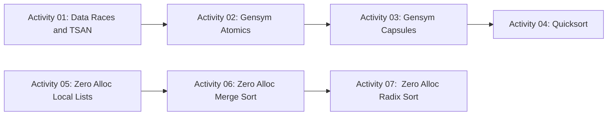

# Hands-on Activities

Each activity is contained in its own folder. Each folder contains a `dune` file
and a `README.md` file with instructions. `dune build` within each directory
will build the activity.

## Activity dependencies

We suggest the following (soft) dependencies for the activities:

