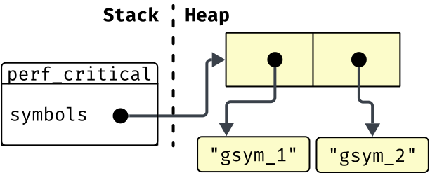
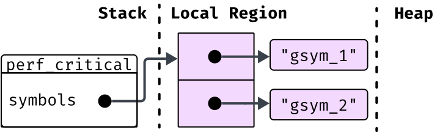

# OxCaml: *safe control over program behavior* 

## ICFP’25 Tutorial

Gavin Gray, Anil Madhavapeddy, KC Sivaramkrishnan, Richard Eisenberg, Chris Casinghino,
Will Crichton, Shriram Krishnamurthi, Patrick Ferris, Max Slater, Megan Del Vecchio, Nadia Razek


<div style="display: grid; grid-template-columns: auto auto;">

  *Before we start, answer this quick question!* 


  <figure>
    
    <figcaption>
        <a href="https://tinyurl.com/icfp25-oxcaml"><code>tinyurl.com/icfp25-oxcaml</code></a>
    </figcaption>
  </figure>

</div>

{pause up}

## OxCaml provides

*Safe control* over performance-critical aspects of program behavior, *in OCaml*

{pause}

- **Control:** over allocation and memory layout

{pause}

- **Safe:** data-race freedom, memory safety

{pause}

- **in OCaml:** OxCaml is a superset of OCaml, so every OCaml program is a valid OxCaml program

{pause up}

# Example 1: Safe Stack Allocation

```ocaml
let gensym =
  let count = ref 0 in
  fun () ->
    count := !count + 1;
    "gsym_" ^ (Int.to_string !count) 
```

{pause}

```ocaml
let perf_critical () = 
  let symbols = [| gensym (); gensym () |] in
  ...
```

{pause}

<div style="display: grid; grid-template-columns: auto auto; gap: 1em;">

  {#memory-layout-correct}
  

  
</div>

{pause exec}
```slip-script
let el = document.querySelector("#memory-layout-correct")
console.log(el)
slip.setClass(el, "correct", true)
```

{pause}

What “bad thing” could happen given these allocations? {pause} *garbage-collection cycle*

{pause center}

What does the compiler need to know/do to avoid these heap allocations?

{pause}

1. Escape analysis: does `symbols` escape this function region?

{pause}

2. Update the code to allocate the array on the stack

{pause up}

## OxCaml Escape Analysis

{pause}

```ocaml
let perf_critical () = 
  let symbols = [| gensym (); gensym () |] in
  ...
```

{pause}

```ocaml
let perf_critical () = 
  let symbols @ local = [| gensym (); gensym () |] in
  ...
```

{pause}

Every value is either `@ local` or `@ global`, the latter is the *OCaml default*

{pause}

A value is `@ local` if it doesn’t escape the current region

{pause}

A value `@ local` *could be locally allocated*

{pause up}

## OxCaml Local Allocation

```ocaml
let perf_critical () = 
  let symbols @ local = [| gensym (); gensym () |] in
  ...
```

We assert that `symbols` is local and doesn’t escape the current region

*How can we ensure that it’s locally allocated?*

{pause}

OxCaml provides new keywords for allocation: `stack_` and `exclave_`

{pause}

### Using `stack_`

```ocaml
let perf_critical () = 
  let symbols @ local = stack_ [| gensym (); gensym () |] in
  ...
```

{pause}

This turns the allocation site for `[| |]` into a *local allocation*

{pause center}

#### The Local Region

The local region is still dynamically sized, but not GC managed. It's cleaned up on function exit

<div style="position: relative; display: grid; grid-template-columns: 1fr 1fr; gap: 1em;">

```ocaml
let perf_critical () = 
  let symbols  = stack_ 
    [| gensym (); gensym () |] in
  ...
```


```rust
fn perf_critical() {
  let arena = Arena::new();
  let symbols = 
    arena.alloc([gensym(), gensym()]);
  ...
}
```

</div>

{pause center}

<div style="display: grid; grid-template-rows: 1fr 1fr;">

  {#memory-layout-local-correct}
  

  
</div>

{pause exec}
```slip-script
let el = document.querySelector("#memory-layout-local-correct")
slip.setClass(el, "correct", true)
```

{pause center}

`stack_` controls the allocation *only* for the `[| |]`, `gensym` still allocates the strings on the heap!

{pause}

```ocaml
val gensym : unit -> string
```

{pause}

```ocaml
val gensym : unit -> string @ global
```

{pause}

Local allocation requires cooperation from *all callees!*

{pause up}

### Using `exclave_`

We may want to use a helper function to create the array

{#stack-not-allocation-site}
```ocaml
let gensym_2 () = 
  [| gensym (); gensym () |]

let perf_critical () = 
  let symbols @ local = stack_ (gensym_2 ()) in
  ...
```

{pause exec}
```slip-script
let el = document.querySelector("#stack-not-allocation-site")
slip.setClass(el, "does-not-compile", true)
```

```
   |   let symbols @ local = stack_ (gensym_2 ()) in
                                    ^^^^^^^^^^^^^
Error: This expression is not an allocation site.
```

{pause}

{#stack-allocation-escapes}
```ocaml
let gensym_2 () = 
  stack_ [| gensym (); gensym () |]

let perf_critical () = 
  let symbols @ local = gensym_2 () in
  ...
```

{pause exec}
```slip-script
let el = document.querySelector("#stack-allocation-escapes")
slip.setClass(el, "does-not-compile", true)
```

<div style="display: grid; grid-template-columns: 1fr 1fr; gap: 1em; position: relative;">

```
   |   stack_ [| gensym (); gensym () |]
       ^^^^^^^^^^^^^^^^^^^^^^^^^^^^^^^^^^
Error: This value escapes its region.
```

{pause}
> 
>
> {.does-not-compile}
>
> ```rust
> fn gensym_2<'a>() -> &'a [String] {
>   let arena = Arena::new();
>   return arena.alloc(
>     [gensym(), gensym()]
>   );
> }
> ```

</div>

{pause center}

`stack_` allocates the array local to `gensym_2`, but we actually want it to be allocated local to `perf_critical`, *the caller.*

{pause up}

```ocaml
let gensym_2 () =
  exclave_ [| gensym (); gensym () |]
```

`exclave_` allocates the value in the caller’s local region

{pause}

{#carousel-memory}
> 
> 

{pause exec}
```slip-script
let first = document.querySelector("#carousel-memory .first")
let second = document.querySelector("#carousel-memory .second")
slip.setStyle(first, "display", "none")
slip.setStyle(second, "display", "block")
```

{pause}

<div style="display: grid; grid-template-columns: 1fr 1fr; gap: 0.5em">

{.does-not-compile}
```ocaml
let perf_critical () = 
  let (f, s) = stack_ 
    (gensym (), gensym ()) in  
  ...
  f  
```

{pause}
```ocaml
let genint =
  let count = ref 0 in
  fun () -> 
    count := !count + 1;
    !count

let perf_critical () =  
  let (f, s) = stack_ 
    (genint (), genint ()) in 
  ...
  f
```

</div>

{pause center}

Integers aren't allocated, so there's no meaningful difference between `int @ local` and `int @ global`

{pause up}

### `@zero_alloc`

You may want to know if your function is truly `zero_alloc`

{#zero-alloc-check}
```ocaml
let[@zero_alloc] gensym_n n =
  exclave_ Array.init n ~f:(fun _ -> gensym ())
```

{pause exec}
```slip-script
let el = document.querySelector("#zero-alloc-check")
slip.setClass(el, "does-not-compile", true)
```

```
   |   Array.init n ~f:(fun _ -> gensym ())
       ^^^^^^^^^^^^^^^^^^^^^^^^^^^^^^^^^^^^
Error: called function may allocate (external call to caml_make_vect)
```

`[@zero_alloc]` uses an abstract interpreter to check if the extent of your function is zero alloc

{pause}

{#zero-alloc-check-2}
```ocaml
let[@zero_alloc] gensym_n n =
  exclave_ (Array.init[@alloc stack]) n ~f:(fun _ -> gensym ())
```

{pause exec}
```slip-script
let el = document.querySelector("#zero-alloc-check-2")
slip.setClass(el, "does-not-compile", true)
```

```
   |                   gensym ()   
                       ^^^^^^^^^
Error: called function may allocate
```

Making `gensym` zero alloc is left as an exercise

{pause up}

## OxCaml So Far

We’ve seen new keywords like `stack_` and `exclave_` that provide control over memory allocation

{pause}

We’ve also seen new annotations, like `@ local` and `@ global`

{pause}

Which can appear on let bindings

```ocaml
let perf_critical () = 
  let symbols @ local = gensym_2 () in
  ...
```

And in type signatures

```ocaml
val gensym_2 : unit -> string array @ local

val Array.init : int -> f:(int -> 'a) -> 'a array @ global
```

{pause}

`local` and `global` are instances of OxCaml *modes*

Modes are how how OxCaml provides *safety*

{pause up}

# A Conceptual Overview of Modes

{#values-container}
<svg xmlns="http://www.w3.org/2000/svg" xmlns:xlink="http://www.w3.org/1999/xlink" xmlns:lucid="lucid" width="1163" height="499.13"><g transform="translate(80 -170.9924320524919)" lucid:page-tab-id="0_0"><path id="green-circle" style="visibility: hidden;" d="M333.9 357.88c27.12 101.18-19.16 201.5-103.35 224.05C146.35 604.5 56.12 540.76 29 439.57 1.9 338.4 48.18 238.07 132.38 215.52c84.2-22.56 174.43 41.17 201.54 142.36z" stroke="#008a0e" stroke-width="6" fill="#e3fae3" opacity=".55"/><path d="M-80 218.66a6 6 0 0 1 6-6H36a6 6 0 0 1 6 6V254a6 6 0 0 1-6 6H-74a6 6 0 0 1-6-6z" fill="none"/><use xlink:href="#a" transform="matrix(1,0,0,1,-75,217.65666666666667) translate(0 29.422222222222224)"/><path id="blue-circle" style="visibility: hidden;" d="M520 450.83c309.28 0 560 41.57 560 92.84 0 51.28-250.72 92.84-560 92.84s-560-41.55-560-92.83c0-51.27 250.72-92.84 560-92.84z" stroke="#1071e5" stroke-width="6" fill="#edf5ff" opacity=".55"/><path d="M860 628.78a6 6 0 0 1 6-6h91.34a6 6 0 0 1 6 6v35.35a6 6 0 0 1-6 6H866a6 6 0 0 1-6-6z" fill="none"/><use xlink:href="#b" transform="matrix(1,0,0,1,865,627.7827910595806) translate(0 29.422222222222224)"/><path d="M181.72 380.9a6 6 0 0 1 6.5-5.48l109.6 9.33a6 6 0 0 1 5.47 6.5l-3 35.2a6 6 0 0 1-6.5 5.48l-109.6-9.34a6 6 0 0 1-5.48-6.5z" fill="none"/><use xlink:href="#c" transform="matrix(0.9963926468233906,0.08486279135332517,-0.08486279135332517,0.9963926468233906,186.7865595672082,380.3146146663196) translate(0 29.422222222222224)"/><path d="M78.1 511.1a6 6 0 0 1 4.8-7.02l144.8-27.28a6 6 0 0 1 7 4.78l6.54 34.74a6 6 0 0 1-4.8 7L91.67 550.6a6 6 0 0 1-7-4.78z" fill="none"/><use xlink:href="#d" transform="matrix(0.9827114579231514,-0.1851437022060278,0.1851437022060278,0.9827114579231514,82.8340227580915,509.1777947113727) translate(0 29.422222222222224)"/><path d="M97.82 297.22a6 6 0 0 1 4.83-6.97l108.22-19.73a6 6 0 0 1 6.98 4.83l6.34 34.77a6 6 0 0 1-4.84 6.98l-108.22 19.72a6 6 0 0 1-6.98-4.83z" fill="none"/><use xlink:href="#e" transform="matrix(0.9837957128643415,-0.17929304322739922,0.17929304322739922,0.9837957128643415,102.55982116223828,295.3438679339185) translate(0 29.422222222222224)"/><path d="M362.26 301.35a6 6 0 0 1 6.63-5.3l72.2 8.2a6 6 0 0 1 5.3 6.63l-3.98 35.1a6 6 0 0 1-6.64 5.3l-72.2-8.18a6 6 0 0 1-5.3-6.63z" fill="none"/><use xlink:href="#f" transform="matrix(0.9936523829624697,0.11249418577422304,-0.11249418577422304,0.9936523829624697,367.3374633795341,300.91817518295255) translate(0 29.422222222222224)"/><path d="M381.67 401.63a6 6 0 0 1 5.33-6.6l183.62-19.75a6 6 0 0 1 6.6 5.32l3.78 35.15a6 6 0 0 1-5.32 6.6L392.06 442.1a6 6 0 0 1-6.6-5.33z" fill="none"/><use xlink:href="#g" transform="matrix(0.9942709500440366,-0.10688909157874266,0.10688909157874266,0.9942709500440366,386.538321427676,400.0988205705683) translate(0 29.422222222222224)"/><path d="M342.8 517.38a6 6 0 0 1 6.4-5.58l128.38 8.74a6 6 0 0 1 5.58 6.4l-2.4 35.26a6 6 0 0 1-6.4 5.58L346 559.03a6 6 0 0 1-5.6-6.4z" fill="none"/><use xlink:href="#h" transform="matrix(0.9976881240025671,0.06795886420650525,-0.06795886420650525,0.9976881240025671,347.86604546006356,516.7199266899072) translate(0 29.422222222222224)"/><path d="M548.75 265.86a6 6 0 0 1 7.14-4.6l235.2 50.95a6 6 0 0 1 4.6 7.15l-7.48 34.54a6 6 0 0 1-7.13 4.58l-235.24-50.94a6 6 0 0 1-4.6-7.13z" fill="none"/><use xlink:href="#i" transform="matrix(0.977341646170929,0.21166791599082405,-0.21166791599082405,0.977341646170929,553.8494333536261,265.9450478108088) translate(0 29.422222222222224)"/><use xlink:href="#j" transform="matrix(0.977341646170929,0.21166791599082405,-0.21166791599082405,0.977341646170929,553.8494333536261,265.9450478108088) translate(74.66666666666667 29.422222222222224)"/><use xlink:href="#k" transform="matrix(0.977341646170929,0.21166791599082405,-0.21166791599082405,0.977341646170929,553.8494333536261,265.9450478108088) translate(130.66666666666669 29.422222222222224)"/><use xlink:href="#l" transform="matrix(0.977341646170929,0.21166791599082405,-0.21166791599082405,0.977341646170929,553.8494333536261,265.9450478108088) translate(186.66666666666669 29.422222222222224)"/><g><path d="M524.04 485.97a6 6 0 0 1 6.55-5.38l406.72 39.88a6 6 0 0 1 5.38 6.56l-3.45 35.17a6 6 0 0 1-6.55 5.4l-406.73-39.9a6 6 0 0 1-5.38-6.55z" fill="none"/></g><g><use xlink:href="#m" transform="matrix(0.9952232586205584,0.09762512740415365,-0.09762512740415365,0.9952232586205584,529.1098896044859,485.4642419301234) translate(0 29.422222222222224)"/><use xlink:href="#n" transform="matrix(0.9952232586205584,0.09762512740415365,-0.09762512740415365,0.9952232586205584,529.1098896044859,485.4642419301234) translate(56 29.422222222222224)"/><use xlink:href="#o" transform="matrix(0.9952232586205584,0.09762512740415365,-0.09762512740415365,0.9952232586205584,529.1098896044859,485.4642419301234) translate(112 29.422222222222224)"/><use xlink:href="#p" transform="matrix(0.9952232586205584,0.09762512740415365,-0.09762512740415365,0.9952232586205584,529.1098896044859,485.4642419301234) translate(186.66666666666669 29.422222222222224)"/><use xlink:href="#q" transform="matrix(0.9952232586205584,0.09762512740415365,-0.09762512740415365,0.9952232586205584,529.1098896044859,485.4642419301234) translate(280 29.422222222222224)"/><use xlink:href="#r" transform="matrix(0.9952232586205584,0.09762512740415365,-0.09762512740415365,0.9952232586205584,529.1098896044859,485.4642419301234) translate(373.33333333333337 29.422222222222224)"/></g><defs><path d="M283-96c58 0 110-29 79-79-30-25-62-31-117-47-91-27-162-58-164-162-3-194 323-203 445-100l-63 93c-49-30-98-45-147-45-53 0-93 23-66 64 70 49 225 51 265 131 13 21 20 49 20 82C533 57 163 54 48-63l79-89c48 37 100 56 156 56" id="s"/><path d="M327-181c-9 94 114 82 169 49l52 101C498 1 440 17 374 17c-132 1-205-70-205-198v-241H58v-109h111v-115l158-19v134h171l-16 109H327v241" id="t"/><path d="M294-412c35-79 80-132 181-135 32 0 61 5 88 16l-29 222H434v-98c-69 14-110 80-131 149v152h105V0H75v-106h70v-320H75v-105h191" id="u"/><path d="M299-809c52-2 94 38 93 89 1 52-40 90-93 89-52 2-95-38-94-89-1-51 42-91 94-89zm95 701h136V0H86v-108h150v-315H91v-108h303v423" id="v"/><path d="M321-432c-45 0-66 30-93 61V0H70v-531h138l11 61c43-46 85-77 165-79 94-1 146 63 146 159V0H372v-344c-2-57-3-88-51-88" id="w"/><path d="M292-548c116 0 174-24 250-68l36 116c-35 14-86 21-153 21 60 28 103 58 103 137 0 138-138 196-287 172-10 4-17 17-17 30 2 51 95 29 146 32 111 6 202 49 202 154 0 133-128 177-284 176-152-2-254-28-257-171h140c0 65 52 65 121 67 74-1 123-6 123-61 0-66-93-53-161-53C163 4 90-26 90-101c0-47 27-81 59-101-59-33-94-70-94-152 0-131 102-194 237-194zm4 103c-52-1-82 37-81 89-1 54 30 91 81 91 55 0 82-35 81-93 0-58-27-87-81-87" id="x"/><g id="a" style="visibility: hidden;"><use transform="matrix(0.031111111111111114,0,0,0.031111111111111114,0,0)" xlink:href="#s"/><use transform="matrix(0.031111111111111114,0,0,0.031111111111111114,18.666666666666668,0)" xlink:href="#t"/><use transform="matrix(0.031111111111111114,0,0,0.031111111111111114,37.333333333333336,0)" xlink:href="#u"/><use transform="matrix(0.031111111111111114,0,0,0.031111111111111114,56,0)" xlink:href="#v"/><use transform="matrix(0.031111111111111114,0,0,0.031111111111111114,74.66666666666667,0)" xlink:href="#w"/><use transform="matrix(0.031111111111111114,0,0,0.031111111111111114,93.33333333333334,0)" xlink:href="#x"/></g><path d="M375 17c-126 1-186-78-186-204v-447H33v-108h314v575c-5 71 92 68 144 43l37 106c-43 23-94 35-153 35" id="y"/><path d="M300-549c163-2 258 116 258 282 0 171-91 285-258 284C133 18 40-95 42-266s89-279 258-283zm0 117c-81 0-94 69-95 166 2 98 14 167 95 167s93-71 95-168c-1-96-14-165-95-165" id="z"/><path d="M352-108c52-2 81-21 118-45l70 100c-47 39-113 70-197 70C169 14 69-89 69-262c0-174 103-283 277-287 87 1 143 25 194 67l-68 95c-39-27-78-40-119-40-79 0-119 55-119 165-1 98 32 151 118 154" id="A"/><path d="M517-153c0 38 8 53 35 64L519 15c-63-7-105-26-130-70-36 43-99 72-174 72C111 20 34-50 35-150c3-153 155-192 330-181 5-70-27-100-105-101-47 1-106 14-146 28L78-509c57-22 135-39 207-40 155 0 232 63 232 188v208zM269-96c41-1 82-27 96-58v-87c-92-6-167 15-167 80 0 42 27 65 71 65" id="B"/><g id="b" style="visibility: hidden;"><use transform="matrix(0.031111111111111114,0,0,0.031111111111111114,0,0)" xlink:href="#y"/><use transform="matrix(0.031111111111111114,0,0,0.031111111111111114,18.666666666666668,0)" xlink:href="#z"/><use transform="matrix(0.031111111111111114,0,0,0.031111111111111114,37.333333333333336,0)" xlink:href="#A"/><use transform="matrix(0.031111111111111114,0,0,0.031111111111111114,56,0)" xlink:href="#B"/><use transform="matrix(0.031111111111111114,0,0,0.031111111111111114,74.66666666666667,0)" xlink:href="#y"/></g><path d="M164-739h105l-16 260h-74zm167 0h105l-15 260h-74" id="C"/><path d="M447-538c76 0 102 52 102 146V0h-77v-378c-4-59 6-89-41-94-34 0-65 21-92 63V0h-78v-378c-4-59 6-89-41-94-34 0-65 21-92 63V0H51v-527h65l6 62c29-39 54-71 114-73 49 0 81 23 95 70 29-39 56-70 116-70" id="D"/><path d="M167-234c1 104 57 173 153 175 63-1 97-20 141-47l39 56c-43 34-108 60-180 61C164 13 77-104 79-263c3-156 76-272 229-275 155-3 231 134 213 304H167zm274-64c0-99-41-171-132-171-93 0-138 73-142 171h274" id="E"/><path d="M519-27c-32 22-89 38-142 38-104 2-177-59-177-158v-314H79v-66h121v-119l84-10v129h183l-11 66H284v313C274-41 417-45 486-84" id="F"/><g id="c"><use transform="matrix(0.031111111111111114,0,0,0.031111111111111114,0,0)" xlink:href="#C"/><use transform="matrix(0.031111111111111114,0,0,0.031111111111111114,18.666666666666668,0)" xlink:href="#D"/><use transform="matrix(0.031111111111111114,0,0,0.031111111111111114,37.333333333333336,0)" xlink:href="#E"/><use transform="matrix(0.031111111111111114,0,0,0.031111111111111114,56,0)" xlink:href="#E"/><use transform="matrix(0.031111111111111114,0,0,0.031111111111111114,74.66666666666667,0)" xlink:href="#F"/><use transform="matrix(0.031111111111111114,0,0,0.031111111111111114,93.33333333333334,0)" xlink:href="#C"/></g><path d="M553-344c1 192-75 355-253 355C119 11 46-148 47-343c3-194 67-357 253-357 179 0 255 163 253 356zm-90 0c0-158-26-283-163-283-136 0-163 126-163 284 0 157 28 281 163 281 136 0 163-124 163-282" id="G"/><path d="M56 0l194-278L79-527h100l122 196 123-196h97L350-282 544 0H442L297-226 152 0H56" id="H"/><path d="M63-345c-4-243 159-405 405-339 31 11 61 28 90 51l-49 57c-41-34-89-51-145-51-146 6-210 112-210 282S215-69 363-63c75 0 116-23 160-57l45 56c-51 50-120 75-206 75C163 3 67-136 63-345" id="I"/><path d="M478-115c0 42 12 57 43 67l-21 60c-51-7-83-32-96-75-34 44-90 74-165 74C137 13 68-51 69-151c3-149 154-179 324-169 10-103-29-151-125-148-40 0-86 9-137 27l-23-64c153-63 370-47 370 137v253zM260-52c60-1 107-35 133-75v-135c-121-4-236-1-234 110 0 67 34 100 101 100" id="J"/><path d="M378 11c-91 1-156-55-156-145v-538H60v-67h246v609c-6 82 110 83 175 53l22 61c-33 18-75 27-125 27" id="K"/><g id="d"><use transform="matrix(0.031111111111111114,0,0,0.031111111111111114,0,0)" xlink:href="#C"/><use transform="matrix(0.031111111111111114,0,0,0.031111111111111114,18.666666666666668,0)" xlink:href="#G"/><use transform="matrix(0.031111111111111114,0,0,0.031111111111111114,37.333333333333336,0)" xlink:href="#H"/><use transform="matrix(0.031111111111111114,0,0,0.031111111111111114,56,0)" xlink:href="#I"/><use transform="matrix(0.031111111111111114,0,0,0.031111111111111114,74.66666666666667,0)" xlink:href="#J"/><use transform="matrix(0.031111111111111114,0,0,0.031111111111111114,93.33333333333334,0)" xlink:href="#D"/><use transform="matrix(0.031111111111111114,0,0,0.031111111111111114,112.00000000000001,0)" xlink:href="#K"/><use transform="matrix(0.031111111111111114,0,0,0.031111111111111114,130.66666666666669,0)" xlink:href="#C"/></g><path d="M497-619H344v550h153V0H103v-69h153v-550H103v-70h394v70" id="L"/><path d="M225-376h270v70H225V0h-87v-689h406l-10 72H225v241" id="M"/><path d="M557-477c3 190-153 233-355 221V0h-86v-689h175c157 0 265 61 266 212zm-93 1c0-139-119-152-262-144v295c147 7 262-3 262-151" id="N"/><g id="e"><use transform="matrix(0.031111111111111114,0,0,0.031111111111111114,0,0)" xlink:href="#C"/><use transform="matrix(0.031111111111111114,0,0,0.031111111111111114,18.666666666666668,0)" xlink:href="#L"/><use transform="matrix(0.031111111111111114,0,0,0.031111111111111114,37.333333333333336,0)" xlink:href="#I"/><use transform="matrix(0.031111111111111114,0,0,0.031111111111111114,56,0)" xlink:href="#M"/><use transform="matrix(0.031111111111111114,0,0,0.031111111111111114,74.66666666666667,0)" xlink:href="#N"/><use transform="matrix(0.031111111111111114,0,0,0.031111111111111114,93.33333333333334,0)" xlink:href="#C"/></g><path d="M269-700c124 3 208 70 208 192 0 120-55 176-124 256-43 48-105 107-184 180h324L483 0H73v-68c136-135 216-196 291-327 54-94 26-241-99-234-79 4-106 26-148 73l-58-45c50-62 107-98 210-99" id="O"/><path d="M300-700c172 0 225 159 225 355 0 197-53 356-225 356S75-148 75-345c0-196 53-355 225-355zM163-345c0 192 46 288 137 288s137-96 137-288c0-191-46-287-137-287s-137 96-137 287zm137-65c36-1 67 30 66 65 1 36-30 67-66 66-36 1-66-30-65-66-1-35 29-66 65-65" id="P"/><path d="M297-368c-48 1-64 9-107 23h-68v-344h365l-12 68H203v217c35-21 68-29 118-30 120 0 192 89 189 216C507-75 421 8 277 11c-77 0-143-27-200-82l52-51c42 43 91 64 148 64 96 0 146-63 145-163 2-95-40-145-125-147" id="Q"/><g id="f"><use transform="matrix(0.031111111111111114,0,0,0.031111111111111114,0,0)" xlink:href="#O"/><use transform="matrix(0.031111111111111114,0,0,0.031111111111111114,18.666666666666668,0)" xlink:href="#P"/><use transform="matrix(0.031111111111111114,0,0,0.031111111111111114,37.333333333333336,0)" xlink:href="#O"/><use transform="matrix(0.031111111111111114,0,0,0.031111111111111114,56,0)" xlink:href="#Q"/></g><path d="M517-68V0H120v-68h169v-529l-157 95-37-59 205-128h74v621h143" id="R"/><path d="M152-14l268-605H97v-70h408v65L230 9" id="S"/><path d="M289-699c157 0 225 106 225 266 4 298-130 391-367 454l-20-64c168-49 290-105 298-294-32 45-87 86-163 85-127-5-196-89-196-220 0-142 85-223 223-227zM154-469c-1 93 36 147 122 149 76-2 117-42 151-92 0-138-19-219-138-219-95 0-135 62-135 162" id="T"/><path d="M269-700c119 2 205 61 211 173 2 81-65 148-134 160 87 6 156 71 156 169C502-24 310 52 146-12c-38-15-69-38-94-68l56-46c32 39 87 67 153 68 92 1 153-51 153-140 4-108-79-141-200-131l10-67c98 9 171-29 171-120 0-74-57-117-130-116-71 2-103 25-146 63l-46-51c56-53 121-80 196-80" id="U"/><path d="M528-167h-89V0h-81v-167H72v-62l202-471 70 30-183 435h198l7-195h73v195h89v68" id="V"/><path d="M506-525c0 85-55 118-119 156 78 33 148 86 148 184C535-55 434 11 298 11 163 11 70-54 65-183c0-77 46-137 139-180-67-33-110-68-110-157 0-118 92-180 206-180 116 0 206 57 206 175zM300-634c-76-1-128 40-124 115 4 95 71 98 152 129 56-37 92-55 96-131 0-72-49-114-124-113zm-2 577c116 0 191-109 126-197-39-53-85-54-163-85-71 33-107 85-107 156 0 83 57 126 144 126" id="W"/><path d="M330-448c126 0 194 84 195 216-3 143-78 243-217 243C129 11 79-132 79-325c0-202 66-365 256-375 50 0 96 14 137 41l-33 56c-82-48-185-39-229 45-30 49-45 117-46 202 38-56 83-92 166-92zM308-57c92 0 132-74 131-172 0-101-41-151-122-151-75 1-121 47-152 98 4 133 26 225 143 225" id="X"/><g id="g"><use transform="matrix(0.031111111111111114,0,0,0.031111111111111114,0,0)" xlink:href="#R"/><use transform="matrix(0.031111111111111114,0,0,0.031111111111111114,18.666666666666668,0)" xlink:href="#S"/><use transform="matrix(0.031111111111111114,0,0,0.031111111111111114,37.333333333333336,0)" xlink:href="#Q"/><use transform="matrix(0.031111111111111114,0,0,0.031111111111111114,56,0)" xlink:href="#T"/><use transform="matrix(0.031111111111111114,0,0,0.031111111111111114,74.66666666666667,0)" xlink:href="#U"/><use transform="matrix(0.031111111111111114,0,0,0.031111111111111114,93.33333333333334,0)" xlink:href="#V"/><use transform="matrix(0.031111111111111114,0,0,0.031111111111111114,112.00000000000001,0)" xlink:href="#V"/><use transform="matrix(0.031111111111111114,0,0,0.031111111111111114,130.66666666666669,0)" xlink:href="#W"/><use transform="matrix(0.031111111111111114,0,0,0.031111111111111114,149.33333333333334,0)" xlink:href="#V"/><use transform="matrix(0.031111111111111114,0,0,0.031111111111111114,168,0)" xlink:href="#X"/></g><path d="M211-77c-1-48 40-89 88-88 49-2 89 40 88 88 1 49-39 89-88 88-48 1-89-40-88-88" id="Y"/><g id="h"><use transform="matrix(0.031111111111111114,0,0,0.031111111111111114,0,0)" xlink:href="#U"/><use transform="matrix(0.031111111111111114,0,0,0.031111111111111114,18.666666666666668,0)" xlink:href="#Y"/><use transform="matrix(0.031111111111111114,0,0,0.031111111111111114,37.333333333333336,0)" xlink:href="#R"/><use transform="matrix(0.031111111111111114,0,0,0.031111111111111114,56,0)" xlink:href="#V"/><use transform="matrix(0.031111111111111114,0,0,0.031111111111111114,74.66666666666667,0)" xlink:href="#R"/><use transform="matrix(0.031111111111111114,0,0,0.031111111111111114,93.33333333333334,0)" xlink:href="#Q"/><use transform="matrix(0.031111111111111114,0,0,0.031111111111111114,112.00000000000001,0)" xlink:href="#T"/></g><path d="M184-815h251v72H264V44h171v71H184v-930" id="Z"/><path d="M299-511c45-2 82 37 81 80 1 44-36 84-81 82-44 1-81-38-80-82-1-43 36-82 80-80zm0 345c79 4 94 87 62 160l-82 186h-76l48-198c-59-38-30-152 48-148" id="aa"/><g id="i"><use transform="matrix(0.031111111111111114,0,0,0.031111111111111114,0,0)" xlink:href="#Z"/><use transform="matrix(0.031111111111111114,0,0,0.031111111111111114,18.666666666666668,0)" xlink:href="#O"/><use transform="matrix(0.031111111111111114,0,0,0.031111111111111114,37.333333333333336,0)" xlink:href="#aa"/></g><g id="j"><use transform="matrix(0.031111111111111114,0,0,0.031111111111111114,0,0)" xlink:href="#U"/><use transform="matrix(0.031111111111111114,0,0,0.031111111111111114,18.666666666666668,0)" xlink:href="#aa"/></g><g id="k"><use transform="matrix(0.031111111111111114,0,0,0.031111111111111114,0,0)" xlink:href="#S"/><use transform="matrix(0.031111111111111114,0,0,0.031111111111111114,18.666666666666668,0)" xlink:href="#aa"/></g><path d="M416 115H165V44h171v-787H165v-72h251v930" id="ab"/><g id="l"><use transform="matrix(0.031111111111111114,0,0,0.031111111111111114,0,0)" xlink:href="#R"/><use transform="matrix(0.031111111111111114,0,0,0.031111111111111114,18.666666666666668,0)" xlink:href="#R"/><use transform="matrix(0.031111111111111114,0,0,0.031111111111111114,37.333333333333336,0)" xlink:href="#ab"/></g><path d="M337 102h-75v-909h75v909" id="ac"/><g id="m"><use transform="matrix(0.031111111111111114,0,0,0.031111111111111114,0,0)" xlink:href="#Z"/><use transform="matrix(0.031111111111111114,0,0,0.031111111111111114,18.666666666666668,0)" xlink:href="#ac"/></g><g id="n"><use transform="matrix(0.031111111111111114,0,0,0.031111111111111114,0,0)" xlink:href="#X"/><use transform="matrix(0.031111111111111114,0,0,0.031111111111111114,18.666666666666668,0)" xlink:href="#aa"/></g><g id="o"><use transform="matrix(0.031111111111111114,0,0,0.031111111111111114,0,0)" xlink:href="#O"/><use transform="matrix(0.031111111111111114,0,0,0.031111111111111114,18.666666666666668,0)" xlink:href="#W"/><use transform="matrix(0.031111111111111114,0,0,0.031111111111111114,37.333333333333336,0)" xlink:href="#aa"/></g><g id="p"><use transform="matrix(0.031111111111111114,0,0,0.031111111111111114,0,0)" xlink:href="#V"/><use transform="matrix(0.031111111111111114,0,0,0.031111111111111114,18.666666666666668,0)" xlink:href="#T"/><use transform="matrix(0.031111111111111114,0,0,0.031111111111111114,37.333333333333336,0)" xlink:href="#X"/><use transform="matrix(0.031111111111111114,0,0,0.031111111111111114,56,0)" xlink:href="#aa"/></g><g id="q"><use transform="matrix(0.031111111111111114,0,0,0.031111111111111114,0,0)" xlink:href="#W"/><use transform="matrix(0.031111111111111114,0,0,0.031111111111111114,18.666666666666668,0)" xlink:href="#R"/><use transform="matrix(0.031111111111111114,0,0,0.031111111111111114,37.333333333333336,0)" xlink:href="#O"/><use transform="matrix(0.031111111111111114,0,0,0.031111111111111114,56,0)" xlink:href="#W"/></g><g id="r"><use transform="matrix(0.031111111111111114,0,0,0.031111111111111114,0,0)" xlink:href="#ac"/><use transform="matrix(0.031111111111111114,0,0,0.031111111111111114,18.666666666666668,0)" xlink:href="#ab"/></g></defs></g></svg>

{pause exec}
```slip-script
let els = document.querySelectorAll(`#values-container > svg g[id='a'], path[id='green-circle']`);
console.debug("Showing", els);
els.forEach((el) => {
  slip.setStyle(el, "visibility", "visible");
});
```

{pause exec}
```slip-script
let els = document.querySelectorAll(`#values-container > svg g[id='b'], path[id='blue-circle']`);
console.debug("Showing", els);
els.forEach((el) => {
  slip.setStyle(el, "visibility", "visible");
});
```

{pause}

{.definition title="What are Modes?"}
  **Modes are deep properties of values.** They refine how values of a type may be used - you can think of types as dividing the universe of values into different buckets, and modes capture cross-cutting properties (e.g., whether a value is stack allocated) that make sense for values of any type.

{pause center}

Example properties

- A value doesn’t escape the region

- A value is unique

{pause center}

- A function can be called from any domain (i.e., thread)

{pause center}

- A function can be invoked at most once

{pause center}

- *and many more ...*

{pause}

Modes provide safety to OxCaml: data-race freedom, and memory safety

{pause up}

## The Locality Axis

The locality axis has two modes: `local` and `global`

with a *submoding* relationship of `global < local`

<div style="display: grid; place-items: center;">

```ocaml
let gensym_2 (): string array @ global = 
  [| gensym (); gensym () |]

let perf_critical () = 
  let symbols @ local = gensym_2 () in
  (* Type checks because of submoding *)
  ...
```

| Mode | Property |
|------|--------------------------|
| `local` | Value doesn’t escape the region |
| **`global`** |  |

</div>

The `@ local` is a *mode annotation*

{pause}

Every mode axis has a default value for backwards compatibility with OCaml

The default for locality is the `global` mode

{pause up}

### Mode Crossing: When Modes and Types Work Together

```ocaml
let genint =
  let count = ref 0 in
  fun () -> 
    count := !count + 1;
    !count

let perf_critical () =  
  let (f, s) = stack_ (genint (), genint ()) in 
  ...
  f
```

This works because integers *cross* locality

{pause}

Locality property: local values don’t escape the region

{pause}

In other words, *locally allocated* values don’t escape the region

{.theorem}
If a type upholds the properties of a mode axis, values of that type mode cross

{pause up}

# Example 2: Safe Parallelism

OCaml 5 introduced parallel programming with a multicore-aware runtime and effects

{pause}

**it also unleashed chaos:** race conditions, nondeterministic bugs, and hard-to-reason-about code.

{pause}

OxCaml introduces two mode axes for data-race freedom: contention and portability

{pause up}

## OCaml 5 introduced a new class of error: Data Races

{#unsafe-gensym-n}
```ocaml
module Par_array = Parallel.Arrays.Array

let gensym =
  let count = ref 0 in
  fun () ->
    count := !count + 1;
    "gsym_" ^ (Int.to_string !count)

let gensym_n par n =
  Par_array.init par n ~f:(fun _ -> gensym ())
```

What could happen if `gensym_n` is called with $n \geq 2$?

{pause exec}
```slip-script
let el = document.querySelector("#unsafe-gensym-n");
slip.setClass(el, "does-not-compile", true)
```

```text
Domain 1           Domain 2
---------------------------------
!count (0)         
---------------------------------
                   !count (0)
---------------------------------
count := 0 + 1     
---------------------------------
                   count := 0 + 1
---------------------------------
!count (1)         
---------------------------------
                   !count (1)
```

Resulting array: `[| "gsym_1"; "gsym_1" |]` Duplicate symbols? Unexpected!

{pause center}

It is *unsafe* to run `gensym` on multiple domains, we want to statically prevent this from happening

{pause}

The code does not compile in OxCaml, but does in OCaml

{pause up}

### Data races require 4 ingredients

1. **Parallel execution** - Code running in different parallel domains (read, threads)
2. **Shared memory** - A location accessible by multiple domains
3. **At least one write** - One domain is modifying the data
4. **No synchronization** - No atomics, etc

{pause}

```ocaml
let gensym = 
  let count = ref 0 in (* (2) shared memory *)
  (*          ^^^^^                  
     (4) bare ref: no synchronization *)
  fun () -> 
    count := !count + 1; (* (3) a write *)
    "gsym_" ^ (Int.to_string !count)

let gen_many par n = 
  (* (1) parallel execution, when n > 1 *)
  Par_array.init par n ~f:(fun _ -> gensym ())
```

{pause center}

The lambda `(fun _ -> gensym ())` must be safe to share across domains

{pause}

The function `gensym` must also be safe to share across domains

{pause}

`gensym` closes over a non-synchronized mutable reference, and *reads* and *writes* to it

{pause}

Therefore, `gensym` is not safe to share across domains 

`(fun _ -> gensym ())` is not safe to share across domains

{pause up}

## Modes for Safe Parallelism

There are two key mode axes for expressing parallelism constraints

{pause}

{#contention-portability-container}
> {.port-area}
> > ### Portability<span class="subtitle">: Is this value (function) safe to share across domains?</span>
> >
> > <div style="display: grid; place-items: center;">
> >
> > `portable < nonportable`
> >
> >
> > | Mode  | Property |
> > |------|--------------------------|
> > | **`nonportable`** | Value isn’t shared across domains |
> > | `portable` |  |
> >
> > </div>
> >
> > {pause-block #gensym-par-array-aside}
> > > {.does-not-compile}
> > > ```ocaml
> > > let gensym @ portable = 
> > >   let count = ref 0 in
> > >   fun () -> 
> > >     count := !count + 1;
> > >     "gsym_" ^ (Int.to_string !count)
> > >
> > > let gen_many par n = 
> > >   Par_array.init par n ~f:(fun _ -> gensym ())
> > > ```
> > > {pause}
> > > ```ocaml
> > > val Par_array.init : Parallel_kernel.t -> int 
> > >   -> f:(int -> 'a @ portable) @ portable (* <-- *)
> > >   -> Par_array.t
> > > ```
> >
> > {pause exec}
> > ```slip-script
> > let el = document.querySelector("#gensym-par-array-aside")
> > slip.setStyle(el, "display", "none")
> > ```
> >
> {.cont-area}
> > ### Contention<span class="subtitle">: What access do I have to this shared memory?</span>
> >
> > <div style="display: grid; place-items: center;">
> >
> > `uncontended < shared < contended`
> >
> > | Mode | Property |
> > |------|--------------------------|
> > | `contended` | Value isn’t read or written |
> > | `shared` | Value isn’t written |
> > | **`uncontended`** | |
> > 
> > </div>

{pause exec}
```slip-script
let el = document.querySelector("#contention-portability-container")
slip.setClass(el, "cont-port-container", true)
```

{pause}

{.corollary}
References captured by portable functions are `contended`

<div style="display: grid; grid-template-columns: 1fr 1fr; gap: 1em; align-items: start;">

{#gensym-par-array-code}
```ocaml
let gensym @ portable = 
  let count = ref 0 in
  fun () -> 
    count := !count + 1;
    "gsym_" ^ (Int.to_string !count)
```

{pause exec}
```slip-script
let el = document.querySelector("#gensym-par-array-code")
slip.setClass(el, "does-not-compile", true)
```

```
  count := !count + 1;
  ^^^^^
Error: This value is contended but 
expected to be uncontended.
```

</div>

{pause up}

## Safely Working with Mutable State

Sometimes we actually need shared mutable state, OxCaml provides two types:

1. **Atomics** for simple operations
2. **Capsules** atomizing complex operations

{pause}

### Atomics

```ocaml
let gensym @ portable = 
  let count = Atomic.make 0 in 
  fun () -> 
    let n = Atomic.fetch_and_add count 1 in 
    "gsym_" ^ (Int.to_string n)
```

{pause}

*Why is using `Atomic` safe but `ref` was not? Why does this code type check?*

{pause}

`Atomic.t` provides synchronization, therefore it **crosses portability and contention**

{pause}

```ocaml
let make_gensym ?(prefix = "gsym_") () = 
  let count = Atomic.make 0 in 
  fun () -> 
    let n = Atomic.fetch_and_add count 1 in 
    prefix ^ (Int.to_string n)
```

{pause}

Can’t race on immutable types, they cross contention

{pause center}

What if `fetch_and_add` didn’t exist?

```ocaml
let gensym @ portable =
  let count = Atomic.make 0 in
  fun () ->
    Atomic.incr count;
    let n = Atomic.get count in
    "gsym_" ^ (Int.to_string n)
```

{pause}

Atomics prevent data races, *but not race conditions.* What we need is for the read and write to be a single atomic operation

{pause up}

### Capsules

If the `Atomic.fetch_and_add` function didn’t exist, could we still write `gensym`?

{pause}

{.definition title="Capsules" #capsules}
Associate mutable state with locks, ensuring exclusive access. Capsules use the type system to track which values have access.

{pause #capsules}

⚠️ **A simpler interface is coming, the following may hurt your eyes** ⚠️

{pause}

```ocaml
let gensym = 
  (* 1. Create capsule and get key *)
  let (P key) = Capsule.create () in

  (* 2. Create encapsulated data *)
  let counter = Capsule.Data.create (fun () -> ref 0) in

  let mutex = Capsule.Mutex.create key in (* 3. Create mutex from key *)

  (* 4. Access with lock *)
  let fetch_and_incr () =
    Capsule.Mutex.with_lock mutex ~f:(fun password ->
      Capsule.Data.extract counter ~password ~f:(fun c ->
        c := !c + 1; !c))
  in
  fun () -> "gsym_" ^ (Int.to_string (fetch_and_incr ()))
```

{pause up}

# Activity!

We’ve prepared a short activity to help you gauge your understanding of OxCaml

<div style="display: grid; place-items: center;">

[`tinyurl.com/oxcaml-icfp25-activity`](https://tinyurl.com/oxcaml-icfp25-activity)


</div>

{pause up}

# OxCaml Summary 

{.remark}
> We have programming activities for those who want to muck around: 
>
> <div style="display:grid; place-items:center;"><a href="https://github.com/oxcaml/tutorial-icfp25"><code>github.com/oxcaml/tutorial-icfp25</code></a></div>
>
> **OxCaml “office hours” daily:** 3-4 @ the Jane Street booth<br/>
> *Can’t make it?* Email me at [`gavinleroy@brown.edu`](mailto:gavinleroy@brown.edu)

OxCaml provides *safe control* over performance-critical aspects of program behavior

- New keywords (e.g., `stack_` and `exclave_`) provide control over memory

- Modes provide the *safety:* for memory and parallelism


<div style="display: flex; flex-direction: row; gap: 0.25em; flex-wrap: wrap; font-size: 1em;">

```ocaml
let gensym_n par n =
  Par_array.init par n 
    ~f:(fun _ -> gensym ())
                 ^^^^^^
Error: The value gensym is nonportable, 
  so cannot be used inside a function 
  that is portable.
```

```ocaml
let[@zero_alloc] gensym_n n = exclave_ 
  (Array.init[@alloc stack]) 
    n ~f:(fun _ -> gensym ())

let perf_critical () = 
  let symbols @ local = gensym_2 () in
  ...
```

</div>
